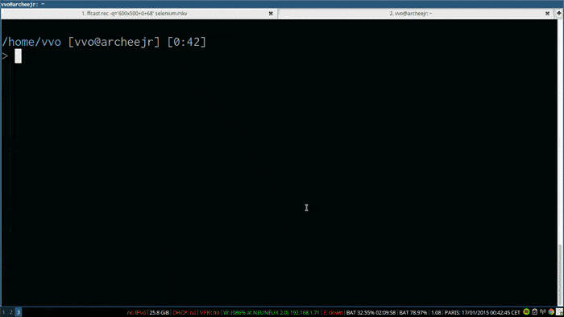

<!-- START doctoc generated TOC please keep comment here to allow auto update -->
<!-- DON'T EDIT THIS SECTION, INSTEAD RE-RUN doctoc TO UPDATE -->


- [selenium-standalone](#selenium-standalone)
  - [Install & Run](#install--run)
  - [Command line interface (CLI)](#command-line-interface-cli)
  - [Application Programming Interface (API)](#application-programming-interface-api)
  - [Available browsers](#available-browsers)
  - [Tips](#tips)
    - [Examples of combining with other tools](#examples-of-combining-with-other-tools)
  - [Contributing](#contributing)

<!-- END doctoc generated TOC please keep comment here to allow auto update -->

# selenium-standalone 
[](https://travis-ci.org/vvo/selenium-standalone) 
[](https://david-dm.org/vvo/selenium-standalone)
[](https://david-dm.org/vvo/selenium-standalone?type=dev)

> A node based CLI library for launching [Selenium](http://www.seleniumhq.org/download/) with WebDrivers support.

Supported WebDrivers:

 * [ChromeDriver](https://github.com/SeleniumHQ/selenium/wiki/ChromeDriver)
 * [geckodriver](https://github.com/mozilla/geckodriver/releases) (Firefox)
 * [IEDriver](https://github.com/SeleniumHQ/selenium/wiki/InternetExplorerDriver)
 * [Edge WebDriver](https://developer.microsoft.com/en-us/microsoft-edge/tools/webdriver/#downloads)
 * [Chromium Edge WebDriver](https://developer.microsoft.com/en-us/microsoft-edge/tools/webdriver/#downloads)


## Install & Run

*As global npm package*

```shell
npm install selenium-standalone -g
selenium-standalone install && selenium-standalone start
```

*As a npm package*

```shell
npm install selenium-standalone --save-dev
npx selenium-standalone install && npx selenium-standalone start
```

*As a Docker service*

```shell
docker run -it -p 4444:4444 vvoyer/selenium-standalone
```



## Command line interface ([CLI](./docs/CLI.md))

See [CLI](./docs/CLI.md) docs

## Application Programming Interface ([API](./docs/API.md))

See [API](./docs/API.md) docs

## Available browsers

By default, Google Chrome, Firefox and Microsoft Edge are available when installed on the host system.

Starting from `v6.22` chrome, edgechromium, and geckodriver support `latest` as version.

## Tips

- [Start Selenium whenever your (ubuntu) machine starts!](./docs/run-when-system-starts.md)
- [Ensure you have the minimum required Java version](./docs/java-versions.md)
- [Logging](./docs/logging.md)
- [`Error: unable to get local issuer certificate`](./docs/issuer-cerificate.md)
- [Running headlessly with xvfb](./docs/xvfb.md)

### Examples of combining with other tools

- [WebdriverIO + Jasmine](https://github.com/mgrybyk/wdio-jasmine-boilerplate) in CircleCI
- [WebdriverIO + Cucumber](https://gitlab.com/bar_foo/wdio-cucumber-typescript) in GitLab

## Contributing

See [Contributing](./CONTRIBUTING.md)
